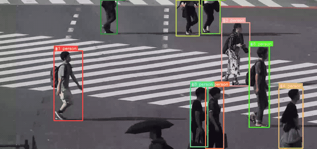

<h1 align="center">modern-yolonas</h1>

<h3 align="center">A clean, minimal reimplementation of YOLO-NAS — no factories, no registries, no OmegaConf. Just PyTorch.</h3>

<p align="center">
  <a href="https://pypi.org/project/modern-yolonas/"></a>
  <a href="https://github.com/CondadosAI/modern-yolonas/actions/workflows/ci.yml"></a>
  <a href="https://condadosai.github.io/modern-yolonas/"></a>
  <a href="https://pypi.org/project/modern-yolonas/"></a>
  <a href="https://github.com/CondadosAI/modern-yolonas/blob/main/LICENSE"></a>
  <a href="https://huggingface.co/spaces/CondadosAI/modern-yolonas-demo"></a>
  <a href="https://github.com/sponsors/CondadosAI"></a>
</p>

<p align="center">
  <a href="https://github.com/Gabriellgpc">Luis Condados</a>&nbsp;&nbsp;
  <a href="https://github.com/alancneves">Alan Neves</a>
</p>

<p align="center">
  
</p>

<p align="center">
  <sub>YOLO-NAS-L, confidence 0.40. Source photo by
  <a href="https://commons.wikimedia.org/wiki/User:Wilfredor">Wilfredor</a>, <a href="https://creativecommons.org/publicdomain/zero/1.0/">CC0</a>.</sub>
</p>

<p align="center">
  <a href="https://huggingface.co/spaces/CondadosAI/modern-yolonas-demo"><b>Live demo</b></a> &nbsp;·&nbsp;
  <a href="https://condadosai.github.io/modern-yolonas/"><b>Documentation</b></a> &nbsp;·&nbsp;
  <a href="https://github.com/CondadosAI/modern-yolonas/blob/main/CHANGELOG.md">Changelog</a> &nbsp;·&nbsp;
  <a href="https://github.com/CondadosAI/modern-yolonas/blob/main/.github/CONTRIBUTING.md">Contributing</a> &nbsp;·&nbsp;
  <a href="https://github.com/CondadosAI/modern-yolonas/issues">Issues</a>
</p>

---

**modern-yolonas** is YOLO-NAS object detection rewritten so you can read the whole thing:
a model variant is a function, a config is a dataclass, and there is no layer of indirection
that exists only to be configurable. `state_dict` keys match
[super-gradients](https://github.com/Deci-AI/super-gradients) exactly, so the original
pretrained COCO checkpoints load with `strict=True`.

Detections come back as [`supervision`](https://github.com/roboflow/supervision) `Detections`,
so every annotator, tracker, zone and metric in that ecosystem works on them out of the box.
Training runs on Lightning, and the model exports to ONNX and OpenVINO — including a
self-contained graph for [Frigate](https://frigate.video/).

---

## 🚀 Updates

- **[2026-09-18]** `v0.5.0` — training moved to [PyTorch Lightning](https://lightning.ai/);
  quantization (`yolonas quantize` for PTQ, `yolonas qat` for QAT) on `torch.ao.quantization`
  FX graph mode; accuracy is now measured by this project rather than quoted; two mAP bugs and
  a mosaic bug fixed; license changed from MIT to **Apache-2.0** for the source.
- **[2026-09-18]** `v0.4.0` — `YoloNASDetector` returns `supervision.Detections`, so results slice and
  plug into the supervision ecosystem directly.
- **[2026-02-05]** `v0.1` — initial release: S/M/L architectures, pretrained weight loading,
  training, COCO evaluation, and ONNX export.

---

## 🏆 Model Zoo

Box AP on COCO val2017, all 5000 images, and latency on the hardware named below. There is
nothing to download by hand — `yolo_nas_s(pretrained=True)` and `YoloNASDetector("yolo_nas_s")`
fetch and cache Deci's COCO checkpoints on first use (they carry Deci's own non-commercial
terms — see **License** below). Pre-exported ONNX, OpenVINO IR and TensorRT engines are on
[the Hub](https://huggingface.co/CondadosAI/modern-yolonas-export).

| Model | Input | Params | GFLOPs | AP | AP<sub>50</sub> | dGPU<br><sub>TensorRT FP16</sub> | CPU<br><sub>OpenVINO INT8</sub> | iGPU<br><sub>OpenVINO INT8</sub> |
|:---|---:|---:|---:|---:|---:|---:|---:|---:|
| **YOLO-NAS-S** | 320 | 19.05M | 8.5 | 38.4 | 53.9 | 1.17 ms<br><sub>855 FPS</sub> | 5.19 ms<br><sub>193 FPS</sub> | 6.83 ms<br><sub>146 FPS</sub> |
| **YOLO-NAS-S** | 640 | 19.05M | 33.9 | 47.3 | 64.4 | 2.12 ms<br><sub>472 FPS</sub> | 19.87 ms<br><sub>50 FPS</sub> | 12.04 ms<br><sub>83 FPS</sub> |
| **YOLO-NAS-M** | 320 | 51.18M | 23.5 | 43.1 | 59.1 | 1.50 ms<br><sub>666 FPS</sub> | 12.03 ms<br><sub>83 FPS</sub> | 9.45 ms<br><sub>106 FPS</sub> |
| **YOLO-NAS-M** | 640 | 51.18M | 94.2 | 51.3 | 68.3 | 4.19 ms<br><sub>239 FPS</sub> | 47.47 ms<br><sub>21 FPS</sub> | 25.49 ms<br><sub>39 FPS</sub> |
| **YOLO-NAS-L** | 320 | 66.98M | 32.2 | 43.8 | 59.9 | 1.94 ms<br><sub>515 FPS</sub> | 15.56 ms<br><sub>64 FPS</sub> | 10.38 ms<br><sub>96 FPS</sub> |
| **YOLO-NAS-L** | 640 | 66.98M | 129.0 | 52.0 | 69.1 | 5.41 ms<br><sub>185 FPS</sub> | 63.00 ms<br><sub>16 FPS</sub> | 32.07 ms<br><sub>31 FPS</sub> |

Every column is measured here, not quoted — regenerate the whole table with
`uv run examples/model_table.py` and `uv run examples/render_model_table.py`. The full grid,
across PyTorch / ONNX Runtime / OpenVINO / TensorRT and CPU / iGPU / dGPU, is in
[the runtime matrix](https://github.com/CondadosAI/modern-yolonas/blob/main/docs/benchmarks/runtime_matrix.md).

<details>
<summary><b>How these numbers were measured, and what they do and do not mean</b></summary>

<br>

**Latency** is model forward only — no preprocessing, no NMS — batch 1, median of 30 runs
after 8 discarded. **FPS is its reciprocal on a single synchronous stream, not throughput**:
a pipeline that overlaps decode, transfer and inference reports more on the same hardware,
and one that counts whole frames reports less, because preprocessing is excluded. Measured on an RTX 3060 Laptop / i7-12700H / Iris Xe, on mains power. The dGPU
column is a TensorRT engine built natively on that card; an `--hardware-compatible` engine,
which is the kind worth publishing, costs 16% at 320 and 8% at 640. Leaderboards that publish
T4 TensorRT latency are not measuring the same thing, so those columns should not be read side
by side.

**320 costs about 9 AP**, consistently across all three variants (−8.9 / −8.2 / −8.2), for
roughly a quarter of the FLOPs. Worth knowing before choosing it: these weights were trained
at 640, so this measures the resolution drop and not a model designed for 320. It also rules
out an obvious-looking trade — YOLO-NAS-L at 320 is faster than YOLO-NAS-S at 640 on a CPU
(15.6 ms against 19.9) and **3.5 AP worse**, so the bigger model at lower resolution is not
the free win the latency column alone suggests.

**Accuracy** is measured in FP32 with NMS at IoU 0.70, which a sweep found to be the optimum.
`postprocess` still defaults to 0.65 for interactive use, where fewer overlapping boxes
matters more than a tenth of AP.

**The weights are Deci's pretrained COCO checkpoints**, so this measures the architecture as
reimplemented here, not weights trained by this project. Deci publishes 47.5 / 51.5 / 52.2,
so roughly 0.2 is unaccounted for — the [model table](https://github.com/CondadosAI/modern-yolonas/blob/main/docs/benchmarks/model_table.md) lists
the protocol differences that were tested and ruled out, and does not guess at the rest.
Numeric agreement with super-gradients is verified far more tightly:
[class scores are bit-identical](https://github.com/CondadosAI/modern-yolonas/blob/main/docs/benchmarks/parity.md).

</details>

---

## 📦 Installation

```bash
uv add modern-yolonas
# or
pip install modern-yolonas
```

Optional extras: `[onnx]`, `[openvino]`, `[fiftyone]`, `[benchmark]`, `[serve]`, `[demo]`, `[tensorboard]`, `[wandb]`.

---

## ⚡ Quick Start

`YoloNASDetector` picks CUDA when it is available and falls back to CPU, so the examples below run
anywhere. Pass `device="cuda"`, `"cpu"` or a `torch.device` to choose explicitly.

### Detect objects in an image

```python
import cv2
from modern_yolonas import YoloNASDetector

det = YoloNASDetector("yolo_nas_s")

image = cv2.imread("image.jpg")
detections = det(image)  # an sv.Detections

for box, score, name in zip(detections.xyxy, detections.confidence, detections.data["class_name"]):
    x1, y1, x2, y2 = box
    print(f"{name}: {score:.2f} [{x1:.0f}, {y1:.0f}, {x2:.0f}, {y2:.0f}]")

# Save annotated image
cv2.imwrite("output.jpg", det.annotate(image, detections))
```

Because the result is a `supervision` container, filtering is slicing:

```python
from modern_yolonas import COCOClass

people = detections[detections.class_id == COCOClass.PERSON]
confident = detections[detections.confidence > 0.5]
big = detections[detections.box_area > 5000]
```

`COCOClass` is an `IntEnum`, so its members are ordinary ints — they just say which class
they are. The ids describe the COCO taxonomy, so they apply to the pretrained checkpoints,
not to a model fine-tuned on your own classes.

and it plugs straight into the rest of the ecosystem:

```python
import supervision as sv

zone = sv.PolygonZone(polygon=my_polygon)
inside = detections[zone.trigger(detections)]

heatmap_annotator = sv.HeatMapAnnotator()
frame = heatmap_annotator.annotate(frame, detections)
```

### Detect objects in a video

<p align="center">
  
</p>

<p align="center">
  <sub>YOLO-NAS-L at confidence 0.25, ~70 detections per frame. Clip by
  <a href="https://commons.wikimedia.org/wiki/User:Basile_Morin">Basile Morin</a>,
  <a href="https://creativecommons.org/licenses/by-sa/4.0/">CC BY-SA 4.0</a> — so this
  clip, unlike the rest of the repository, is CC BY-SA rather than Apache-2.0.</sub>
</p>

```python
from modern_yolonas import YoloNASDetector

det = YoloNASDetector("yolo_nas_s")

# Option 1: Write annotated video directly
stats = det.detect_video_to_file("input.mp4", "output.mp4")
print(f"{stats['total_detections']} detections across {stats['total_frames']} frames")

# Option 2: Iterate frames for custom logic
for frame_idx, frame, detections in det.detect_video("input.mp4"):
    print(f"Frame {frame_idx}: {len(detections)} objects")
    # detections.xyxy, .confidence, .class_id are numpy arrays
    # det.annotate(frame, detections) returns the annotated BGR frame
```

### Live webcam detection

```python
import cv2
from modern_yolonas import YoloNASDetector

det = YoloNASDetector("yolo_nas_s")

for frame_idx, frame, detections in det.detect_video(source=0):  # 0 = default camera
    cv2.imshow("YOLO-NAS", det.annotate(frame, detections))
    if cv2.waitKey(1) & 0xFF == ord("q"):
        break
cv2.destroyAllWindows()
```

### Feature embeddings

The detector throws the backbone's representation away and keeps four numbers per object.
`YoloNASEmbedder` keeps the representation — for image retrieval, near-duplicate search,
clustering and re-identification. Nothing extra is trained: same weights, read one stage earlier.

<p align="center">
  
</p>

<p align="center">
  <sub>Regenerate with <code>uv run examples/embedding_space_figure.py</code>. Gallery photos by
  <a href="https://unsplash.com/photos/omi6C5fdiLA">Mike Petrucci</a> and
  <a href="https://unsplash.com/photos/YpngzEY9ijY">Gabriel Gurrola</a>, CC0.</sub>
</p>

```python
import numpy as np
from modern_yolonas import YoloNASEmbedder

embedder = YoloNASEmbedder("yolo_nas_s")

vector = embedder("image.jpg")                     # (768,) L2-normalized
gallery = embedder.embed_batch(["a.jpg", "b.jpg"]) # (2, 768)

# Both sides are normalized, so a dot product is the cosine similarity.
ranking = np.argsort(-(gallery @ vector))
```

### Detections and embeddings in one pass

Detection and embedding share the whole network up to the head, so there is no reason to
run the backbone twice. `predict` takes `Task` flags and gives you both:

```python
from modern_yolonas import COCOClass, Task, YoloNASDetector

detector = YoloNASDetector("yolo_nas_s")
result = detector.predict(image, Task.DETECT | Task.EMBED | Task.EMBED_OBJECTS)

result.detections                       # sv.Detections
result.embedding                        # (768,) whole-image vector
result.detections.data["embedding"]     # (N, 768), one row per detection

# The per-object vectors live in `data`, so they follow the boxes through slicing:
people = result.detections[result.detections.class_id == COCOClass.PERSON]
people.data["embedding"]                # rows still aligned with people.xyxy
```

`Task.EMBED_OBJECTS` implies `Task.DETECT`; fields you did not ask for come back `None`.
`detector(image)` still works — it is shorthand for `predict(image, Task.DETECT).detections`.

Raw feature maps, if you want to pool them yourself:

```python
features = model.forward_features(x)   # c2 c3 c4 c5 (backbone) + p3 p4 p5 (neck)
```

All three shapes export to ONNX — `--target embedding`, `--target combined`, and
`--target objects`, the last a self-contained graph with NMS inside it that emits
`detections [D, 7]` and one vector per detection.

See the [embeddings guide](https://condadosai.github.io/modern-yolonas/guides/embeddings/)
for layer choice and why the letterbox padding is excluded from pooling, and the
[export guide](https://condadosai.github.io/modern-yolonas/guides/export/) for the
`valid_region` input the exported graphs take.

### Track objects across a video



<sub>Boxes are coloured by track id, not by class, so an ID-swap shows as a colour change.
48 frames, 14 ids, 10 of them alive for at least half the clip.</sub>

Tracking uses the same forward pass as detection — the per-object embeddings Deep HM-SORT
associates on are the ones the detector already computed, so appearance-aware tracking
costs one pass per frame rather than two.

```python
from modern_yolonas import YoloNASDetector
from modern_yolonas.tracking import DeepHMSort

detector = YoloNASDetector("yolo_nas_s")
tracker = DeepHMSort()

for frame_index, frame, detections in detector.track_video("match.mp4", tracker):
    detections.tracker_id          # (N,) stable ids
    detections.data["embedding"]   # (N, 768) the vectors it associated on

# Or straight to a file, with ids drawn on
stats = detector.track_video_to_file("match.mp4", "tracked.mp4")
stats["unique_ids"]                # distinct objects the tracker believes it saw
```

A lost track stays findable for **2 seconds of video** by default, counted with the clip's
own frame rate rather than in frames, so the number means the same thing at 25 and 60 fps:

```python
DeepHMSort()                       # 2 s — good default for open scenes
DeepHMSort(max_lost_seconds=10.0)  # a doorway, where people come back
DeepHMSort(max_lost_seconds=None)  # the paper: keep every tracklet, forever
```

The paper never discards a tracklet, which is right for a fixed camera on a closed pitch and
wrong for a street — there the pool grows with every object ever seen. `--keep-all-tracks`
restores the paper's behaviour.

[Deep HM-SORT](https://arxiv.org/abs/2406.12081) fuses the motion and appearance costs with
their **harmonic mean** instead of taking the smaller one, which stops a lookalike from
stealing an id on appearance alone, and it keeps every tracklet for the whole sequence so an
object that leaves the frame and returns is re-identified rather than renumbered. It has no
Kalman filter — [Deep-EIoU](https://arxiv.org/abs/2306.13074) drops it in favour of expanding
the boxes before intersecting them.

The appearance vectors are a by-product of detection, not a re-identification model trained
to tell two people apart, so the paper's HOTA numbers are not inherited here. Any `(N, D)`
array in `detections.data["embedding"]` is associated on, so a purpose-trained model drops
straight in — see the [tracking guide](https://condadosai.github.io/modern-yolonas/guides/tracking/).

### Low-level model API

```python
import torch
from modern_yolonas import yolo_nas_s

model = yolo_nas_s(pretrained=True).eval().cuda()
x = torch.randn(1, 3, 640, 640).cuda()
pred_bboxes, pred_scores = model(x)
# pred_bboxes: [1, 8400, 4] — x1y1x2y2 pixel coordinates
# pred_scores: [1, 8400, 80] — class probabilities
```

---

## 🖥️ CLI

Full reference: [CLI docs](https://condadosai.github.io/modern-yolonas/cli/).

```bash
# Detect in images
yolonas detect --model yolo_nas_s --source image.jpg --conf 0.25
yolonas detect --model yolo_nas_l --source images/ --output results/

# Detect in video
yolonas detect --model yolo_nas_s --source video.mp4 --output results/
yolonas detect --model yolo_nas_m --source video.mp4 --skip-frames 2 --conf 0.3

# Track objects across a video (Deep HM-SORT)
yolonas track --source match.mp4 --classes 0
yolonas track --source match.mp4 --fusion min                  # the Deep-EIoU baseline
yolonas track --source lobby.mp4 --max-lost-seconds 10          # remember people for longer

# Training
yolonas train --model yolo_nas_s --data /path/to/dataset --format yolo --epochs 100

# Evaluation
yolonas eval --model yolo_nas_s --data /path/to/coco --split val2017

# Export (needs the extras: pip install "modern-yolonas[onnx]" / [openvino])
yolonas export --model yolo_nas_s --format onnx --output model.onnx
yolonas export --model yolo_nas_s --format openvino --output model.xml

# Export feature embeddings, alone or beside the detections
yolonas export --model yolo_nas_s --target embedding --output embedding.onnx
yolonas export --model yolo_nas_s --target combined --output combined.onnx
yolonas export --model yolo_nas_s --target objects --output objects.onnx

# Export for Frigate (embeds preprocessing + NMS in the graph)
yolonas export --model yolo_nas_s --format onnx --target frigate
yolonas export --model yolo_nas_s --format openvino --target frigate --input-size 320
```

<details>
<summary><b>Frigate integration</b></summary>

<br>

The `--target frigate` export produces a self-contained model that accepts raw `uint8` BGR
input and outputs a flat `[D, 7]` tensor with `[batch, x1, y1, x2, y2, confidence, class_id]`.

```yaml
detectors:
  ov:
    type: openvino
    device: GPU

model:
  model_type: yolonas
  width: 320
  height: 320
  input_tensor: nchw
  input_pixel_format: bgr
  path: /config/model_frigate.xml
```

</details>

---

## 📚 Tutorials

Step-by-step notebooks in [`tutorials/`](https://github.com/CondadosAI/modern-yolonas/tree/main/tutorials/):

| Topic | Notebook | Description |
|---|---|---|
| **Roboflow** | [`roboflow/01_explore_dataset.ipynb`](https://github.com/CondadosAI/modern-yolonas/blob/main/tutorials/roboflow/01_explore_dataset.ipynb) | Download from Roboflow + explore |
| | [`roboflow/02_finetune.ipynb`](https://github.com/CondadosAI/modern-yolonas/blob/main/tutorials/roboflow/02_finetune.ipynb) | Fine-tune + evaluate + visualize |
| **FiftyOne** | [`fiftyone/01_explore_dataset.ipynb`](https://github.com/CondadosAI/modern-yolonas/blob/main/tutorials/fiftyone/01_explore_dataset.ipynb) | Load from FiftyOne Zoo + explore |
| | [`fiftyone/02_finetune.ipynb`](https://github.com/CondadosAI/modern-yolonas/blob/main/tutorials/fiftyone/02_finetune.ipynb) | Fine-tune + evaluate + visualize |
| | [`fiftyone/03_embedding_space.ipynb`](https://github.com/CondadosAI/modern-yolonas/blob/main/tutorials/fiftyone/03_embedding_space.ipynb) | Explore a YOLO-NAS embedding space + find duplicates |
| **Export** | [`export_onnx.ipynb`](https://github.com/CondadosAI/modern-yolonas/blob/main/tutorials/export_onnx.ipynb) | ONNX export from any checkpoint |
| **Quantization** | [`quantization_ptq.ipynb`](https://github.com/CondadosAI/modern-yolonas/blob/main/tutorials/quantization_ptq.ipynb) | Post-Training Quantization |
| | [`quantization_qat.ipynb`](https://github.com/CondadosAI/modern-yolonas/blob/main/tutorials/quantization_qat.ipynb) | Quantization-Aware Training |
| **Inference** | [`inference_onnx.ipynb`](https://github.com/CondadosAI/modern-yolonas/blob/main/tutorials/inference_onnx.ipynb) | ONNX Runtime inference |

### Examples

Start with the notebook — install, detect, visualize, and inspect the raw model output in
one pass:

- [`notebooks/quickstart.ipynb`](https://github.com/CondadosAI/modern-yolonas/blob/main/notebooks/quickstart.ipynb)

Or the standalone scripts in [`examples/`](https://github.com/CondadosAI/modern-yolonas/blob/main/examples/):

- [`parity_check.py`](https://github.com/CondadosAI/modern-yolonas/blob/main/examples/parity_check.py) — verify this implementation matches
  super-gradients (writes [`docs/benchmarks/parity.md`](https://github.com/CondadosAI/modern-yolonas/blob/main/docs/benchmarks/parity.md))
- [`runtime_matrix.py`](https://github.com/CondadosAI/modern-yolonas/blob/main/examples/runtime_matrix.py) — latency across PyTorch /
  ONNX Runtime / OpenVINO / TensorRT, CPU / Intel iGPU / NVIDIA dGPU, FP32 / FP16 / INT8 and every
  input size (writes [`docs/benchmarks/runtime_matrix.md`](https://github.com/CondadosAI/modern-yolonas/blob/main/docs/benchmarks/runtime_matrix.md))
- [`runtime_accuracy.py`](https://github.com/CondadosAI/modern-yolonas/blob/main/examples/runtime_accuracy.py) — COCO AP for an
  *exported* artifact, so an INT8 file's accuracy is measured rather than assumed
- [`export_zoo.py`](https://github.com/CondadosAI/modern-yolonas/blob/main/examples/export_zoo.py) — pre-export every variant to every
  runtime and size, with a manifest
- [`detect_image.py`](https://github.com/CondadosAI/modern-yolonas/blob/main/examples/detect_image.py) — run detection on a single image
- [`detect_video.py`](https://github.com/CondadosAI/modern-yolonas/blob/main/examples/detect_video.py) — run detection on a video file
- [`detect_webcam.py`](https://github.com/CondadosAI/modern-yolonas/blob/main/examples/detect_webcam.py) — live webcam detection
- [`track_video.py`](https://github.com/CondadosAI/modern-yolonas/blob/main/examples/track_video.py) — track a video with Deep HM-SORT and
  report whether the ids are fragmenting

---

## 🛠️ Development

```bash
uv sync --dev
uv run pre-commit install

uv run pytest tests/ -v
uv run ruff check src/ tests/
```

Contributions are welcome. Please read [CONTRIBUTING.md](https://github.com/CondadosAI/modern-yolonas/blob/main/.github/CONTRIBUTING.md) — it lists
the API design principles a change is reviewed against — and the
[Code of Conduct](https://github.com/CondadosAI/modern-yolonas/blob/main/.github/CODE_OF_CONDUCT.md).

---

## 💖 Sponsoring

Sponsorship funds the GPU time behind this project — chiefly the from-scratch COCO weights
that will replace Deci's non-commercial checkpoints. What that costs and where the money goes
is written out on the [sponsors page](https://github.com/sponsors/CondadosAI).

<p align="center">
  <a href="https://github.com/sponsors/CondadosAI"><b>❤️ Sponsor on GitHub</b></a>
</p>

Companies that need an invoice, a different arrangement, or a specific benchmark run: open an
[issue](https://github.com/CondadosAI/modern-yolonas/issues) and we will sort it out there.

Sponsors are listed in [SPONSORS.md](https://github.com/CondadosAI/modern-yolonas/blob/main/SPONSORS.md);
company sponsors get their logo here and on the docs site.

<!-- sponsor-logos:start -->
<p align="center">
  <sub><i>No company sponsors yet — yours would be the first.</i></sub>
</p>
<!-- sponsor-logos:end -->

---

## 📄 License

Apache-2.0 — **applies to the source code only**. See [LICENSE](https://github.com/CondadosAI/modern-yolonas/blob/main/LICENSE).

**Pretrained weights notice:** the pretrained COCO weights downloaded by this library (via
`pretrained=True`) are provided by Deci AI and are subject to
[Deci's YOLO-NAS license](https://github.com/Deci-AI/super-gradients/blob/master/LICENSE.YOLONAS.md),
which restricts commercial use and redistribution. The Apache-2.0 license of this repository
does **not** cover them. If you train your own weights from scratch, those are entirely yours.

---

## 🙏 Acknowledgments

This project is a clean-room reimplementation of the YOLO-NAS architecture originally
developed by [Deci AI](https://deci.ai/) and published in their
[super-gradients](https://github.com/Deci-AI/super-gradients) library (Apache-2.0). The model
architecture, module structure and `state_dict` key naming were derived from the
super-gradients source to enable pretrained weight compatibility.

It also builds directly on [supervision](https://github.com/roboflow/supervision),
[PyTorch Lightning](https://lightning.ai/) and [OpenVINO](https://github.com/openvinotoolkit/openvino).

Thanks to everyone who has [contributed](https://github.com/CondadosAI/modern-yolonas/graphs/contributors)
— in particular [Alan Neves](https://github.com/alancneves), whose work on augmentations,
metrics, gradient accumulation, the ONNX export path and super-gradients parity shaped much
of the training stack.

---

## ⭐ Star History

<p align="center">
  <a href="https://star-history.com/#CondadosAI/modern-yolonas&Date">
    <picture>
      <source media="(prefers-color-scheme: dark)" srcset="https://api.star-history.com/svg?repos=CondadosAI/modern-yolonas&type=Date&theme=dark">
      <source media="(prefers-color-scheme: light)" srcset="https://api.star-history.com/svg?repos=CondadosAI/modern-yolonas&type=Date">
      
    </picture>
  </a>
</p>

---

## 📖 Citation

If you use modern-yolonas in your research or project, please cite it:

```bibtex
@software{condados2026modernyolonas,
  author       = {Condados, Luis and Neves, Alan},
  title        = {modern-yolonas: A Clean Reimplementation of YOLO-NAS},
  year         = {2026},
  url          = {https://github.com/CondadosAI/modern-yolonas},
  license      = {Apache-2.0}
}
```
