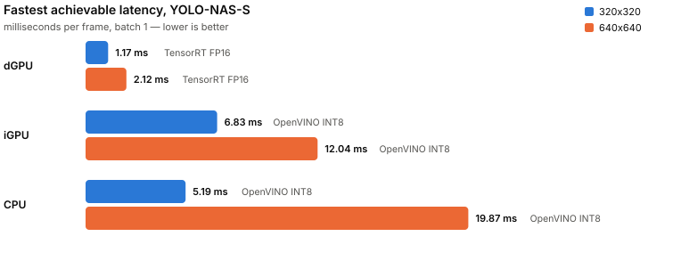

# Latency: which runtime, on which device, at which size

Generated by `examples/runtime_matrix.py`, rendered by `examples/render_runtime_matrix.py`.
Every number is measured on the machine below. Nothing here is quoted.

## The short answer

<picture>
  <source media="(prefers-color-scheme: dark)" srcset="runtime_matrix-dark.svg">
  
</picture>

| hardware | fastest at 320 | fastest at 640 |
|---|---|---|
| dGPU | **0.91 ms** — TensorRT FP16 | **2.15 ms** — TensorRT FP16 |
| iGPU | **6.83 ms** — OpenVINO INT8 | **12.04 ms** — OpenVINO INT8 |
| CPU | **5.19 ms** — OpenVINO INT8 | **19.87 ms** — OpenVINO INT8 |

YOLO-NAS-S, model inference only, NMS left to the caller.
The other variants are in the per-device tables below.

## What each choice costs

Each percentage is against the alternative named in the row, on the same
hardware. **A positive number is a slowdown you are choosing to accept** for
the reason in the last column; a negative one is a straight win.

| choice | 320 | 640 | what it buys |
|---|---:|---:|---|
| TensorRT `--hardware-compatible` | +17% | +9% | an engine that loads on any sm_80+ GPU instead of only this one |
| `--target end2end` vs torchvision NMS | +54% | +34% | one self-contained file, no Python in the inference path |
| TensorRT FP16 vs FP32 | -60% | -61% | a speedup, not a trade — the AP cost is in the model table |
| OpenVINO INT8 vs FP32, CPU | -68% | -69% | also a speedup; whether it costs AP is measured separately |

## Per device

### dGPU

<sub>`NVIDIA GeForce RTX 3060 Laptop GPU (dGPU)` · `dGPU` · `dGPU ampere_plus` · `dGPU native`</sub>

| runtime | precision | NMS | 320 ms | 640 ms |
|---|---|---|---:|---:|
| TensorRT | FP16 | external | 0.91 | 2.15 |
| TensorRT ampere_plus | FP16 | external | 1.07 | 2.34 |
| TensorRT | FP16 | torch | 1.26 | 2.48 |
| TensorRT ampere_plus | FP16 | torch | 1.44 | 2.64 |
| TensorRT | FP16 | graph | 1.94 | 3.33 |
| TensorRT ampere_plus | FP16 | graph | 2.09 | 3.58 |
| TensorRT | FP32 | external | 2.28 | 5.56 |
| TensorRT | FP32 | graph | 2.55 | 6.14 |
| TensorRT | FP32 | torch | 2.56 | 5.86 |
| PyTorch | FP32 | external | 4.95 | 9.55 |
| PyTorch | FP32 | torch | 5.24 | 9.90 |
| PyTorch | FP16 | external | 5.49 | 6.25 |
| PyTorch | FP16 | torch | 5.84 | 6.59 |
| OpenVINO | INT8 | external | 19.39 | 63.61 |
| OpenVINO | FP32 | graph | 22.65 | 83.56 |
| OpenVINO | FP16 | graph | 22.68 | 83.26 |
| OpenVINO | FP16 | external | 28.88 | 103.83 |
| OpenVINO | FP32 | external | 29.02 | 103.93 |

### iGPU

<sub>`Intel(R) Iris(R) Xe Graphics (iGPU)`</sub>

| runtime | precision | NMS | 320 ms | 640 ms |
|---|---|---|---:|---:|
| OpenVINO | INT8 | external | 6.83 | 12.04 |
| OpenVINO | FP32 | external | 7.05 | 19.23 |
| OpenVINO | FP16 | external | 7.09 | 19.25 |
| OpenVINO | FP16 | graph | 13.73 | 34.74 |
| OpenVINO | FP32 | graph | 13.78 | 34.14 |

### CPU

<sub>`12th Gen Intel(R) Core(TM) i7-12700H` · `CPU`</sub>

| runtime | precision | NMS | 320 ms | 640 ms |
|---|---|---|---:|---:|
| OpenVINO | INT8 | external | 5.19 | 19.87 |
| ORT | FP32 | external | 14.73 | 61.13 |
| ORT | FP32 | graph | 14.97 | 62.69 |
| OpenVINO | FP16 | external | 15.86 | 64.65 |
| OpenVINO | FP32 | external | 16.17 | 65.02 |
| OpenVINO | FP32 | graph | 16.24 | 66.30 |
| OpenVINO | FP16 | graph | 16.38 | 65.96 |
| PyTorch | FP32 | external | 33.57 | 103.20 |

## How this was measured

Batch 1, single stream, synchronous. Median of 30 runs after 8 warmup runs
discarded whole. GPU work is synchronised before the clock is read. Latency,
not throughput — an async multi-stream pipeline reports higher FPS on the same
hardware.

The **NMS** column says what is included:

- `external` — the model only. Returns raw `[N, 4]` + `[N, 80]` tensors and
  leaves NMS to the caller, so this number is not a whole detection.
- `torch` — the model plus `postprocess`, torchvision's batched NMS, on the
  tensors where they already are. On a CUDA leg nothing crosses to the host.
- `graph` — `--target end2end`, with NonMaxSuppression inside the graph.

`torch` and `graph` are the two comparable ones. `external` is there because it
is what every published latency figure for this kind of model actually reports.

The input is a real COCO frame with 62 annotated objects, not random noise:
nothing in noise clears a 0.25 score, so every NMS leg would sort an empty list
and report itself free.

**Machine.**

- `cpu`: x86_64
- `gpu`: NVIDIA GeForce RTX 3060 Laptop GPU
- `driver`: 580.173.02
- `platform`: Linux-6.8.0-138-generic-x86_64-with-glibc2.35
- `power_source`: mains
- `python`: 3.12.9
- `torch`: 2.10.0+cu130
- `onnxruntime`: 1.24.3
- `openvino`: 2026.3.1-22476-759c5a6ab8c-releases/2026/3
- `tensorrt`: 11.3.0.99
- `input`: real frame

The power source is recorded because it changes the answer: this laptop GPU is
power-capped on battery, and the same pass runs materially slower there. The SM
clock is sampled at the end of each timed run rather than at startup, where an
idle card reports a clock it was not running at.

<details>
<summary><b>Everything measured</b> — all variants, all legs</summary>

| model | runtime | device | precision | NMS | input | median ms | FPS |
|---|---|---|---|---|---:|---:|---:|
| yolo_nas_l | TensorRT | dGPU native | FP16 | external | 320 | 2.18 | 457.9 |
| yolo_nas_l | TensorRT | dGPU native | FP16 | torch | 320 | 2.29 | 437.2 |
| yolo_nas_l | TensorRT | dGPU ampere_plus | FP16 | external | 320 | 2.80 | 357.6 |
| yolo_nas_l | TensorRT | dGPU ampere_plus | FP16 | torch | 320 | 3.18 | 314.1 |
| yolo_nas_l | TensorRT | dGPU native | FP32 | torch | 320 | 6.55 | 152.6 |
| yolo_nas_l | TensorRT | dGPU native | FP32 | external | 320 | 6.58 | 152.0 |
| yolo_nas_l | PyTorch | dGPU | FP16 | external | 320 | 6.80 | 147.0 |
| yolo_nas_l | PyTorch | dGPU | FP16 | torch | 320 | 6.97 | 143.4 |
| yolo_nas_l | PyTorch | dGPU | FP32 | external | 320 | 8.30 | 120.5 |
| yolo_nas_l | PyTorch | dGPU | FP32 | torch | 320 | 8.56 | 116.8 |
| yolo_nas_l | OpenVINO | Intel(R) Iris(R) Xe Graphics (iGPU) | INT8 | external | 320 | 10.38 | 96.4 |
| yolo_nas_l | OpenVINO | 12th Gen Intel(R) Core(TM) i7-12700H | INT8 | external | 320 | 15.56 | 64.3 |
| yolo_nas_l | OpenVINO | Intel(R) Iris(R) Xe Graphics (iGPU) | FP16 | external | 320 | 16.99 | 58.9 |
| yolo_nas_l | OpenVINO | Intel(R) Iris(R) Xe Graphics (iGPU) | FP32 | external | 320 | 17.13 | 58.4 |
| yolo_nas_l | ORT | CPU | FP32 | external | 320 | 49.68 | 20.1 |
| yolo_nas_l | OpenVINO | 12th Gen Intel(R) Core(TM) i7-12700H | FP32 | external | 320 | 52.19 | 19.2 |
| yolo_nas_l | OpenVINO | 12th Gen Intel(R) Core(TM) i7-12700H | FP16 | external | 320 | 52.93 | 18.9 |
| yolo_nas_l | OpenVINO | NVIDIA GeForce RTX 3060 Laptop GPU (dGPU) | INT8 | external | 320 | 85.41 | 11.7 |
| yolo_nas_l | OpenVINO | NVIDIA GeForce RTX 3060 Laptop GPU (dGPU) | FP16 | external | 320 | 101.48 | 9.9 |
| yolo_nas_l | OpenVINO | NVIDIA GeForce RTX 3060 Laptop GPU (dGPU) | FP32 | external | 320 | 102.38 | 9.8 |
| yolo_nas_l | PyTorch | CPU | FP32 | external | 320 | 107.92 | 9.3 |
| yolo_nas_l | PyTorch | dGPU | FP16 | external | 640 | 14.26 | 70.1 |
| yolo_nas_l | PyTorch | dGPU | FP16 | torch | 640 | 14.56 | 68.7 |
| yolo_nas_l | PyTorch | dGPU | FP32 | external | 640 | 23.72 | 42.2 |
| yolo_nas_l | PyTorch | dGPU | FP32 | torch | 640 | 24.56 | 40.7 |
| yolo_nas_l | OpenVINO | Intel(R) Iris(R) Xe Graphics (iGPU) | INT8 | external | 640 | 32.07 | 31.2 |
| yolo_nas_l | OpenVINO | Intel(R) Iris(R) Xe Graphics (iGPU) | FP16 | external | 640 | 54.88 | 18.2 |
| yolo_nas_l | OpenVINO | Intel(R) Iris(R) Xe Graphics (iGPU) | FP32 | external | 640 | 56.81 | 17.6 |
| yolo_nas_l | OpenVINO | 12th Gen Intel(R) Core(TM) i7-12700H | INT8 | external | 640 | 63.00 | 15.9 |
| yolo_nas_l | ORT | CPU | FP32 | external | 640 | 184.49 | 5.4 |
| yolo_nas_l | OpenVINO | 12th Gen Intel(R) Core(TM) i7-12700H | FP32 | external | 640 | 233.35 | 4.3 |
| yolo_nas_l | OpenVINO | 12th Gen Intel(R) Core(TM) i7-12700H | FP16 | external | 640 | 238.65 | 4.2 |
| yolo_nas_l | OpenVINO | NVIDIA GeForce RTX 3060 Laptop GPU (dGPU) | INT8 | external | 640 | 295.70 | 3.4 |
| yolo_nas_l | PyTorch | CPU | FP32 | external | 640 | 320.75 | 3.1 |
| yolo_nas_l | OpenVINO | NVIDIA GeForce RTX 3060 Laptop GPU (dGPU) | FP16 | external | 640 | 370.70 | 2.7 |
| yolo_nas_l | OpenVINO | NVIDIA GeForce RTX 3060 Laptop GPU (dGPU) | FP32 | external | 640 | 371.70 | 2.7 |
| yolo_nas_m | TensorRT | dGPU native | FP16 | external | 320 | 1.76 | 566.8 |
| yolo_nas_m | TensorRT | dGPU native | FP16 | torch | 320 | 2.15 | 465.2 |
| yolo_nas_m | TensorRT | dGPU ampere_plus | FP16 | external | 320 | 2.25 | 444.3 |
| yolo_nas_m | TensorRT | dGPU ampere_plus | FP16 | torch | 320 | 2.63 | 380.8 |
| yolo_nas_m | TensorRT | dGPU native | FP32 | external | 320 | 4.79 | 208.8 |
| yolo_nas_m | TensorRT | dGPU native | FP32 | torch | 320 | 5.28 | 189.4 |
| yolo_nas_m | PyTorch | dGPU | FP16 | external | 320 | 5.66 | 176.6 |
| yolo_nas_m | PyTorch | dGPU | FP16 | torch | 320 | 5.94 | 168.2 |
| yolo_nas_m | PyTorch | dGPU | FP32 | torch | 320 | 6.97 | 143.4 |
| yolo_nas_m | PyTorch | dGPU | FP32 | external | 320 | 7.93 | 126.2 |
| yolo_nas_m | OpenVINO | Intel(R) Iris(R) Xe Graphics (iGPU) | INT8 | external | 320 | 9.45 | 105.9 |
| yolo_nas_m | OpenVINO | 12th Gen Intel(R) Core(TM) i7-12700H | INT8 | external | 320 | 12.03 | 83.1 |
| yolo_nas_m | OpenVINO | Intel(R) Iris(R) Xe Graphics (iGPU) | FP32 | external | 320 | 13.46 | 74.3 |
| yolo_nas_m | OpenVINO | Intel(R) Iris(R) Xe Graphics (iGPU) | FP16 | external | 320 | 13.63 | 73.4 |
| yolo_nas_m | ORT | CPU | FP32 | external | 320 | 38.81 | 25.8 |
| yolo_nas_m | OpenVINO | 12th Gen Intel(R) Core(TM) i7-12700H | FP16 | external | 320 | 39.61 | 25.2 |
| yolo_nas_m | OpenVINO | 12th Gen Intel(R) Core(TM) i7-12700H | FP32 | external | 320 | 42.71 | 23.4 |
| yolo_nas_m | OpenVINO | NVIDIA GeForce RTX 3060 Laptop GPU (dGPU) | INT8 | external | 320 | 59.27 | 16.9 |
| yolo_nas_m | OpenVINO | NVIDIA GeForce RTX 3060 Laptop GPU (dGPU) | FP16 | external | 320 | 74.73 | 13.4 |
| yolo_nas_m | OpenVINO | NVIDIA GeForce RTX 3060 Laptop GPU (dGPU) | FP32 | external | 320 | 75.30 | 13.3 |
| yolo_nas_m | PyTorch | CPU | FP32 | external | 320 | 79.69 | 12.5 |
| yolo_nas_m | TensorRT | dGPU native | FP16 | external | 640 | 4.35 | 230.0 |
| yolo_nas_m | TensorRT | dGPU native | FP16 | torch | 640 | 4.41 | 226.6 |
| yolo_nas_m | TensorRT | dGPU ampere_plus | FP16 | external | 640 | 4.74 | 210.8 |
| yolo_nas_m | TensorRT | dGPU ampere_plus | FP16 | torch | 640 | 4.82 | 207.6 |
| yolo_nas_m | PyTorch | dGPU | FP16 | external | 640 | 11.30 | 88.5 |
| yolo_nas_m | PyTorch | dGPU | FP16 | torch | 640 | 11.57 | 86.4 |
| yolo_nas_m | TensorRT | dGPU native | FP32 | external | 640 | 12.82 | 78.0 |
| yolo_nas_m | TensorRT | dGPU native | FP32 | torch | 640 | 13.36 | 74.8 |
| yolo_nas_m | PyTorch | dGPU | FP32 | external | 640 | 18.00 | 55.6 |
| yolo_nas_m | PyTorch | dGPU | FP32 | torch | 640 | 18.52 | 54.0 |
| yolo_nas_m | OpenVINO | Intel(R) Iris(R) Xe Graphics (iGPU) | INT8 | external | 640 | 25.49 | 39.2 |
| yolo_nas_m | OpenVINO | Intel(R) Iris(R) Xe Graphics (iGPU) | FP32 | external | 640 | 40.56 | 24.7 |
| yolo_nas_m | OpenVINO | Intel(R) Iris(R) Xe Graphics (iGPU) | FP16 | external | 640 | 40.71 | 24.6 |
| yolo_nas_m | OpenVINO | 12th Gen Intel(R) Core(TM) i7-12700H | INT8 | external | 640 | 47.47 | 21.1 |
| yolo_nas_m | ORT | CPU | FP32 | external | 640 | 134.75 | 7.4 |
| yolo_nas_m | OpenVINO | 12th Gen Intel(R) Core(TM) i7-12700H | FP32 | external | 640 | 154.80 | 6.5 |
| yolo_nas_m | OpenVINO | 12th Gen Intel(R) Core(TM) i7-12700H | FP16 | external | 640 | 157.00 | 6.4 |
| yolo_nas_m | OpenVINO | NVIDIA GeForce RTX 3060 Laptop GPU (dGPU) | INT8 | external | 640 | 204.67 | 4.9 |
| yolo_nas_m | PyTorch | CPU | FP32 | external | 640 | 224.41 | 4.5 |
| yolo_nas_m | OpenVINO | NVIDIA GeForce RTX 3060 Laptop GPU (dGPU) | FP16 | external | 640 | 272.39 | 3.7 |
| yolo_nas_m | OpenVINO | NVIDIA GeForce RTX 3060 Laptop GPU (dGPU) | FP32 | external | 640 | 273.64 | 3.7 |
| yolo_nas_s | TensorRT | dGPU native | FP16 | external | 320 | 0.91 | 1102.2 |
| yolo_nas_s | TensorRT | dGPU ampere_plus | FP16 | external | 320 | 1.07 | 938.7 |
| yolo_nas_s | TensorRT | dGPU native | FP16 | torch | 320 | 1.26 | 796.5 |
| yolo_nas_s | TensorRT | dGPU ampere_plus | FP16 | torch | 320 | 1.44 | 696.6 |
| yolo_nas_s | TensorRT | dGPU native | FP16 | graph | 320 | 1.94 | 515.6 |
| yolo_nas_s | TensorRT | dGPU ampere_plus | FP16 | graph | 320 | 2.09 | 478.5 |
| yolo_nas_s | TensorRT | dGPU native | FP32 | external | 320 | 2.28 | 437.8 |
| yolo_nas_s | TensorRT | dGPU native | FP32 | graph | 320 | 2.55 | 392.4 |
| yolo_nas_s | TensorRT | dGPU native | FP32 | torch | 320 | 2.56 | 390.0 |
| yolo_nas_s | PyTorch | dGPU | FP32 | external | 320 | 4.95 | 202.0 |
| yolo_nas_s | OpenVINO | 12th Gen Intel(R) Core(TM) i7-12700H | INT8 | external | 320 | 5.19 | 192.6 |
| yolo_nas_s | PyTorch | dGPU | FP32 | torch | 320 | 5.24 | 190.9 |
| yolo_nas_s | PyTorch | dGPU | FP16 | external | 320 | 5.49 | 182.3 |
| yolo_nas_s | PyTorch | dGPU | FP16 | torch | 320 | 5.84 | 171.1 |
| yolo_nas_s | OpenVINO | Intel(R) Iris(R) Xe Graphics (iGPU) | INT8 | external | 320 | 6.83 | 146.4 |
| yolo_nas_s | OpenVINO | Intel(R) Iris(R) Xe Graphics (iGPU) | FP32 | external | 320 | 7.05 | 141.9 |
| yolo_nas_s | OpenVINO | Intel(R) Iris(R) Xe Graphics (iGPU) | FP16 | external | 320 | 7.09 | 140.9 |
| yolo_nas_s | OpenVINO | Intel(R) Iris(R) Xe Graphics (iGPU) | FP16 | graph | 320 | 13.73 | 72.8 |
| yolo_nas_s | OpenVINO | Intel(R) Iris(R) Xe Graphics (iGPU) | FP32 | graph | 320 | 13.78 | 72.6 |
| yolo_nas_s | ORT | CPU | FP32 | external | 320 | 14.73 | 67.9 |
| yolo_nas_s | ORT | CPU | FP32 | graph | 320 | 14.97 | 66.8 |
| yolo_nas_s | OpenVINO | 12th Gen Intel(R) Core(TM) i7-12700H | FP16 | external | 320 | 15.86 | 63.1 |
| yolo_nas_s | OpenVINO | 12th Gen Intel(R) Core(TM) i7-12700H | FP32 | external | 320 | 16.17 | 61.8 |
| yolo_nas_s | OpenVINO | 12th Gen Intel(R) Core(TM) i7-12700H | FP32 | graph | 320 | 16.24 | 61.6 |
| yolo_nas_s | OpenVINO | 12th Gen Intel(R) Core(TM) i7-12700H | FP16 | graph | 320 | 16.38 | 61.1 |
| yolo_nas_s | OpenVINO | NVIDIA GeForce RTX 3060 Laptop GPU (dGPU) | INT8 | external | 320 | 19.39 | 51.6 |
| yolo_nas_s | OpenVINO | NVIDIA GeForce RTX 3060 Laptop GPU (dGPU) | FP32 | graph | 320 | 22.65 | 44.1 |
| yolo_nas_s | OpenVINO | NVIDIA GeForce RTX 3060 Laptop GPU (dGPU) | FP16 | graph | 320 | 22.68 | 44.1 |
| yolo_nas_s | OpenVINO | NVIDIA GeForce RTX 3060 Laptop GPU (dGPU) | FP16 | external | 320 | 28.88 | 34.6 |
| yolo_nas_s | OpenVINO | NVIDIA GeForce RTX 3060 Laptop GPU (dGPU) | FP32 | external | 320 | 29.02 | 34.5 |
| yolo_nas_s | PyTorch | CPU | FP32 | external | 320 | 33.57 | 29.8 |
| yolo_nas_s | TensorRT | dGPU native | FP16 | external | 640 | 2.15 | 464.5 |
| yolo_nas_s | TensorRT | dGPU ampere_plus | FP16 | external | 640 | 2.34 | 427.1 |
| yolo_nas_s | TensorRT | dGPU native | FP16 | torch | 640 | 2.48 | 402.9 |
| yolo_nas_s | TensorRT | dGPU ampere_plus | FP16 | torch | 640 | 2.64 | 378.1 |
| yolo_nas_s | TensorRT | dGPU native | FP16 | graph | 640 | 3.33 | 300.2 |
| yolo_nas_s | TensorRT | dGPU ampere_plus | FP16 | graph | 640 | 3.58 | 279.5 |
| yolo_nas_s | TensorRT | dGPU native | FP32 | external | 640 | 5.56 | 179.7 |
| yolo_nas_s | TensorRT | dGPU native | FP32 | torch | 640 | 5.86 | 170.5 |
| yolo_nas_s | TensorRT | dGPU native | FP32 | graph | 640 | 6.14 | 162.8 |
| yolo_nas_s | PyTorch | dGPU | FP16 | external | 640 | 6.25 | 160.0 |
| yolo_nas_s | PyTorch | dGPU | FP16 | torch | 640 | 6.59 | 151.8 |
| yolo_nas_s | PyTorch | dGPU | FP32 | external | 640 | 9.55 | 104.7 |
| yolo_nas_s | PyTorch | dGPU | FP32 | torch | 640 | 9.90 | 101.0 |
| yolo_nas_s | OpenVINO | Intel(R) Iris(R) Xe Graphics (iGPU) | INT8 | external | 640 | 12.04 | 83.0 |
| yolo_nas_s | OpenVINO | Intel(R) Iris(R) Xe Graphics (iGPU) | FP32 | external | 640 | 19.23 | 52.0 |
| yolo_nas_s | OpenVINO | Intel(R) Iris(R) Xe Graphics (iGPU) | FP16 | external | 640 | 19.25 | 52.0 |
| yolo_nas_s | OpenVINO | 12th Gen Intel(R) Core(TM) i7-12700H | INT8 | external | 640 | 19.87 | 50.3 |
| yolo_nas_s | OpenVINO | Intel(R) Iris(R) Xe Graphics (iGPU) | FP32 | graph | 640 | 34.14 | 29.3 |
| yolo_nas_s | OpenVINO | Intel(R) Iris(R) Xe Graphics (iGPU) | FP16 | graph | 640 | 34.74 | 28.8 |
| yolo_nas_s | ORT | CPU | FP32 | external | 640 | 61.13 | 16.4 |
| yolo_nas_s | ORT | CPU | FP32 | graph | 640 | 62.69 | 16.0 |
| yolo_nas_s | OpenVINO | NVIDIA GeForce RTX 3060 Laptop GPU (dGPU) | INT8 | external | 640 | 63.61 | 15.7 |
| yolo_nas_s | OpenVINO | 12th Gen Intel(R) Core(TM) i7-12700H | FP16 | external | 640 | 64.65 | 15.5 |
| yolo_nas_s | OpenVINO | 12th Gen Intel(R) Core(TM) i7-12700H | FP32 | external | 640 | 65.02 | 15.4 |
| yolo_nas_s | OpenVINO | 12th Gen Intel(R) Core(TM) i7-12700H | FP16 | graph | 640 | 65.96 | 15.2 |
| yolo_nas_s | OpenVINO | 12th Gen Intel(R) Core(TM) i7-12700H | FP32 | graph | 640 | 66.30 | 15.1 |
| yolo_nas_s | OpenVINO | NVIDIA GeForce RTX 3060 Laptop GPU (dGPU) | FP16 | graph | 640 | 83.26 | 12.0 |
| yolo_nas_s | OpenVINO | NVIDIA GeForce RTX 3060 Laptop GPU (dGPU) | FP32 | graph | 640 | 83.56 | 12.0 |
| yolo_nas_s | PyTorch | CPU | FP32 | external | 640 | 103.20 | 9.7 |
| yolo_nas_s | OpenVINO | NVIDIA GeForce RTX 3060 Laptop GPU (dGPU) | FP16 | external | 640 | 103.83 | 9.6 |
| yolo_nas_s | OpenVINO | NVIDIA GeForce RTX 3060 Laptop GPU (dGPU) | FP32 | external | 640 | 103.93 | 9.6 |

</details>

<details>
<summary><b>Not measured</b> — recorded rather than dropped</summary>

A runtime missing from the environment is information; a silent gap is not.

- **ORT / dGPU / FP32 / 320 / nms=external** — RuntimeError: asked for CUDAExecutionProvider, session resolved to ['CPUExecutionProvider'
- **ORT / dGPU / FP32 / 320 / nms=external** — RuntimeError: asked for CUDAExecutionProvider, session resolved to ['CPUExecutionProvider'
- **ORT / dGPU / FP32 / 320 / nms=external** — RuntimeError: asked for CUDAExecutionProvider, session resolved to ['CPUExecutionProvider'
- **ORT / dGPU / FP32 / 320 / nms=graph** — RuntimeError: asked for CUDAExecutionProvider, session resolved to ['CPUExecutionProvider'
- **ORT / dGPU / FP32 / 640 / nms=external** — RuntimeError: asked for CUDAExecutionProvider, session resolved to ['CPUExecutionProvider'
- **ORT / dGPU / FP32 / 640 / nms=external** — RuntimeError: asked for CUDAExecutionProvider, session resolved to ['CPUExecutionProvider'
- **ORT / dGPU / FP32 / 640 / nms=external** — RuntimeError: asked for CUDAExecutionProvider, session resolved to ['CPUExecutionProvider'
- **ORT / dGPU / FP32 / 640 / nms=graph** — RuntimeError: asked for CUDAExecutionProvider, session resolved to ['CPUExecutionProvider'
- **OpenVINO / 12th Gen Intel(R) Core(TM) i7-12700H / INT8 / 320 / nms=graph** — NNCF cannot calibrate through graph NMS
- **OpenVINO / 12th Gen Intel(R) Core(TM) i7-12700H / INT8 / 640 / nms=graph** — NNCF cannot calibrate through graph NMS
- **OpenVINO / Intel(R) Iris(R) Xe Graphics (iGPU) / INT8 / 320 / nms=graph** — NNCF cannot calibrate through graph NMS
- **OpenVINO / Intel(R) Iris(R) Xe Graphics (iGPU) / INT8 / 640 / nms=graph** — NNCF cannot calibrate through graph NMS
- **OpenVINO / NVIDIA GeForce RTX 3060 Laptop GPU (dGPU) / INT8 / 320 / nms=graph** — NNCF cannot calibrate through graph NMS
- **OpenVINO / NVIDIA GeForce RTX 3060 Laptop GPU (dGPU) / INT8 / 640 / nms=graph** — NNCF cannot calibrate through graph NMS

</details>

## Reproducing

```bash
uv sync --dev --extra onnx --extra openvino --extra tensorrt
uv run examples/runtime_matrix.py --models yolo_nas_s --sizes 320,640 \
    --nms external,torch,graph --calibration-dir ~/datasets/coco/images/val2017 \
    --sample-image ~/datasets/coco/images/val2017/000000435081.jpg

# ONNX Runtime's CUDA provider needs the other wheel, which cannot coexist with
# the CPU one, so its rows come from a second pass that merges into the same JSON:
uv sync --dev --extra onnx-gpu --extra tensorrt
uv run examples/runtime_matrix.py --runtimes ort --sizes 320,640

uv run examples/render_runtime_matrix.py
```

## On comparing this with published leaderboards

Detection leaderboards usually report TensorRT latency on an NVIDIA T4 at batch 1.
That is not the hardware above, and a latency figure means nothing without its
protocol, so the two should not be read side by side.
