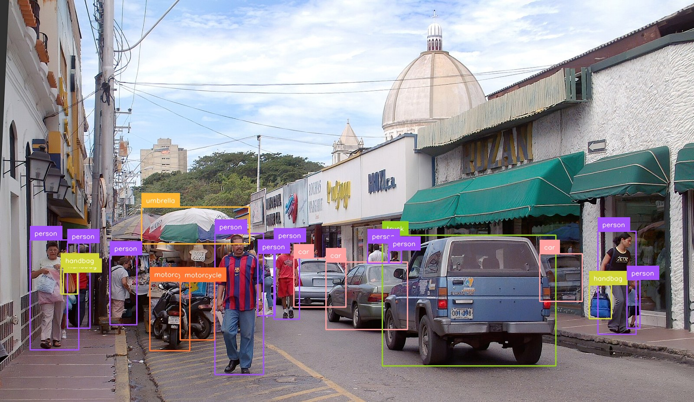

# modern-yolonas

A clean, minimal Python reimplementation of [YOLO-NAS](https://github.com/Deci-AI/super-gradients) object detection. No factory patterns, no registries, no OmegaConf — just PyTorch.



<video src="assets/demo_video.mp4" autoplay loop muted playsinline width="100%">
  Your browser does not support the video element.
</video>

## Features

- **Drop-in pretrained weights** — loads super-gradients COCO checkpoints directly
- **Simple API** — `YoloNASDetector("yolo_nas_s")` → call with an image → get `sv.Detections`
- **Ecosystem native** — results are [supervision](https://github.com/roboflow/supervision) `Detections`: slice to filter, and plug into its annotators, trackers and zones
- **Embeddings and tracking in the detection pass** — per-object vectors and Deep HM-SORT ids for one forward pass per frame
- **CLI** — `yolonas detect`, `yolonas track`, `yolonas train`, `yolonas export`, `yolonas eval`
- **ONNX / OpenVINO export** — including Frigate-compatible graph surgery
- **Training** — full training loop with DDP, AMP, EMA, cosine LR
- **All 3 variants** — S (19.05M), M (51.18M), L (66.98M)

## Quick install

```bash
pip install modern-yolonas
```

## Minimal example

```python
import cv2
from modern_yolonas import YoloNASDetector

det = YoloNASDetector("yolo_nas_s")

image = cv2.imread("image.jpg")
detections = det(image)
cv2.imwrite("output.jpg", det.annotate(image, detections))
```

## Next steps

- [Getting Started](getting-started.md) — install, first detection, CLI basics
- [API Reference](api/detector.md) — full Python API
- [Guides](guides/training.md) — training, export, extending

## Sponsoring

Sponsorship funds the GPU time behind this project — chiefly the from-scratch COCO weights
that will replace Deci's non-commercial checkpoints. What that costs and where the money goes
is on the [sponsors page](https://github.com/sponsors/CondadosAI); sponsors are listed in
[SPONSORS.md](https://github.com/CondadosAI/modern-yolonas/blob/main/SPONSORS.md).

<!-- sponsor-logos:start -->
<p align="center">
  <sub><i>No company sponsors yet — yours would be the first.</i></sub>
</p>
<!-- sponsor-logos:end -->
